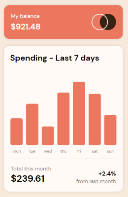
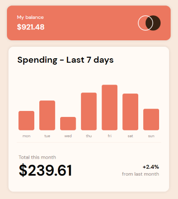

# Frontend Mentor - Expenses chart component solution

Hello! 👋

Below is a solution to the [Expenses chart component challenge on Frontend Mentor](https://www.frontendmentor.io/challenges/expenses-chart-component-e7yJBUdjwt). Frontend Mentor challenges help you improve your coding skills by building realistic projects. 

## Table of contents

- [Overview](#overview)
  - [The challenge](#the-challenge)
  - [Screenshot](#screenshot)
  - [Links](#links)
- [My process](#my-process)
  - [Built with](#built-with)
  - [What I learned](#what-i-learned)
  - [Continued development](#continued-development)
  - [Useful resources](#useful-resources)
- [Author](#author)

## Overview

### The challenge

Users should be able to:

- View the bar chart and hover over the individual bars to see the correct amounts for each day ✔️
- See the current day’s bar highlighted in a different colour to the other bars ✔️
- View the optimal layout for the content depending on their device’s screen size ✔️
- See hover states for all interactive elements on the page ✔️
- **Bonus**: Use the JSON data file provided to dynamically size the bars on the chart ✔️

### Screenshot

### Links

- Solution URL: [Add solution URL here](https://github.com/jhellard/expense)
- Live Site URL: [Add live site URL here](https://beautiful-eclair-509f00.netlify.app/)

## My process

I started with the layout, getting everything in place with dummy data. Once it was responsive and looked right I implemented dynamic columns and totals using the provided json data. Using Styled Components and Sass for styling, it made it fairly simply to replicate.

### Built with

- Semantic HTML5 markup
- CSS custom properties
- Flexbox
- CSS Grid
- Mobile-first workflow
---
- [React](https://reactjs.org/) - JS library
- [Sass](https://sass-lang.com/) - Main styling
- [Styled Components](https://styled-components.com/) - Adaptive styling (Dynamic Column Height)

### What I learned

While I have used Styled Components before, this was a good refresher for changing CSS properties using dynamic variables. The bar will dynamically change size depending on the amount.

It's always fun to try and achieve your goals as quickly as possible and I was very satisfied in the time it took me to put this together.

---

### Continued development

I would like to add a way to dynamically change the amounts in-app and store them locally on the users machine, allowing them to actually track their spending. I'm sure it will be satisfying to watch the columns populate as the days are inputted.

### Useful resources

- [W3 Schools](https://www.w3schools.com/) - For the 50 property names I couldn't remember, W3 Schools was always the first place I'd check.
- [CSS-Tricks](https://css-tricks.com/) - Great website for more specific styling choices, lots of cool effects and interesting ways to achieve your desired effect.

## Author

- Website - [Joshua Hellard](https://www.jhellard.com)
- Frontend Mentor - [@jhellard](https://www.frontendmentor.io/profile/jhellard)